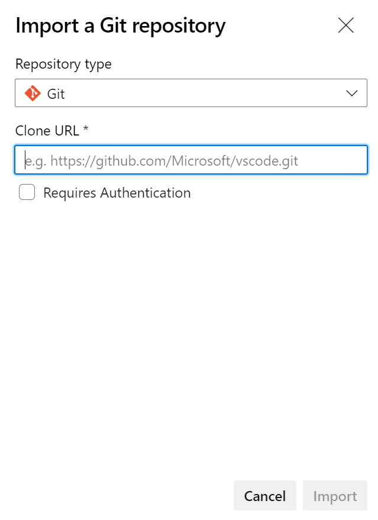

# Azure Pipelines Workshop

This repository contains modules for the workshop on creating CI/CD pipelines using Azure pipelines.

## Setup the workspace

1. Sign in to [Azure DevOps](https://dev.azure.com/) using your personal microsoft account.

2. Create an organization. You can provide any name, make sure it's a unique one.

3. Create a project by clicking the `New Project` button.

    > The project will hoist your pipeline repository.

4. Create a repository in the first project space for your extension code.

5. Import the repository into your Azure repository
(We will upload the same code to the azure repository).

    + Click the `Import` button in the new repository window and add
        the git url of the current repository in the **Clone URL** field.

        

    + Using the command line:

        ```shell
        # Git clone the repository
        git clone https://github.com/Biswajee/Azure-Pipelines-Workshop.git

        # Remove the remote url for the cloned repo
        git remote remove origin

        # Add the new remote url from your azure devops extension repository
        git remote add origin https://<OrganizationName>@dev.azure.com/<OrganizationName>/<ProjectName>/_git/<AzureRepositoryName>
        git push -u origin --all
        ```

6. Check whether the code you've pushed got successfully updated in the azure devops respository.
